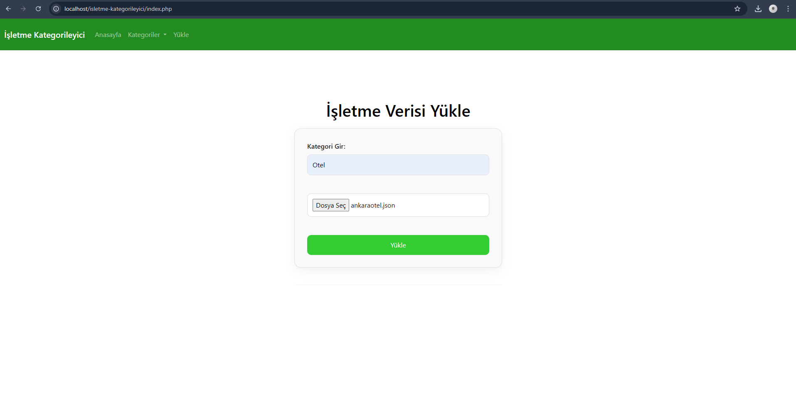
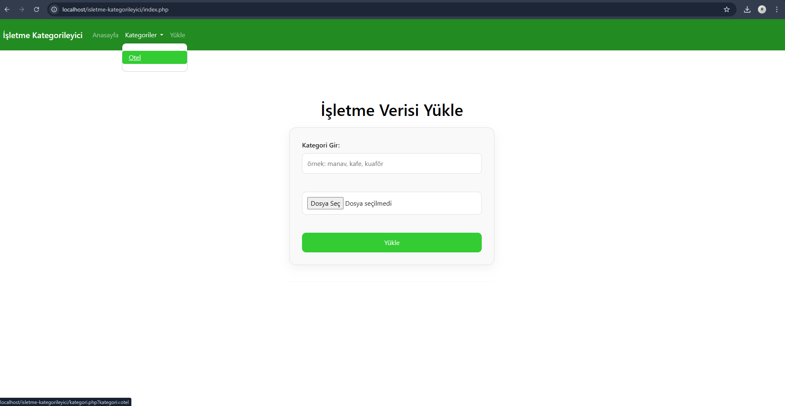
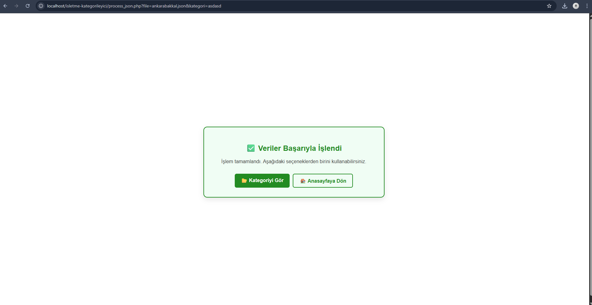
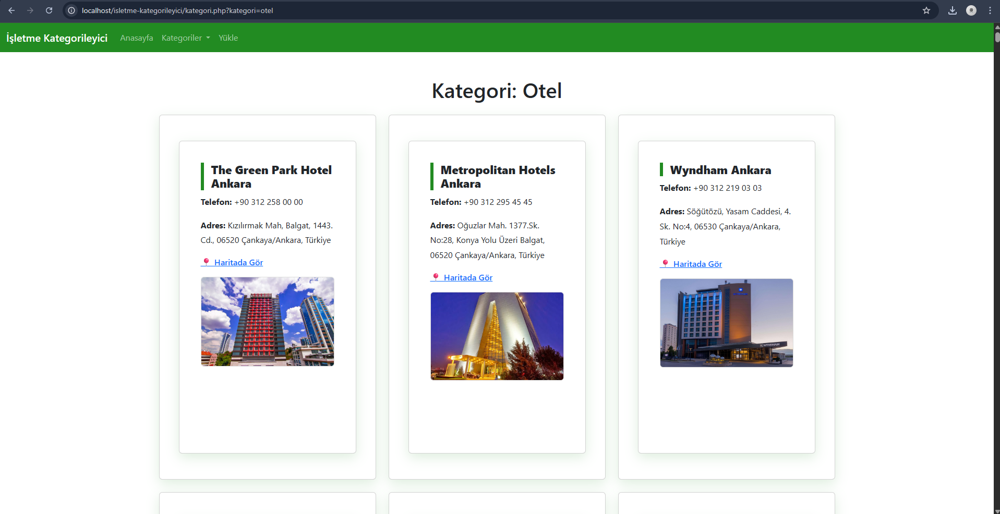

Bu proje, kullanıcıların belirledikleri kategori adına göre işletme verisi yükleyip görüntüleyebildiği basit bir web uygulamasıdır. Kullanıcılar, .json formatındaki işletme verilerini, ilgili kategori ismini girerek sisteme yüklerler. Uygulama, verilen kategori ismine ait işletmeleri listeler.

Aynı kategori ismiyle yeni bir .json dosyası yüklenirse, mevcut kategoriye yeni veriler eklenir ve liste güncellenir. Arama veya filtreleme fonksiyonu bulunmamaktadır; tüm gösterim kategori bazlıdır. 

Ekran Görüntüleri : 

